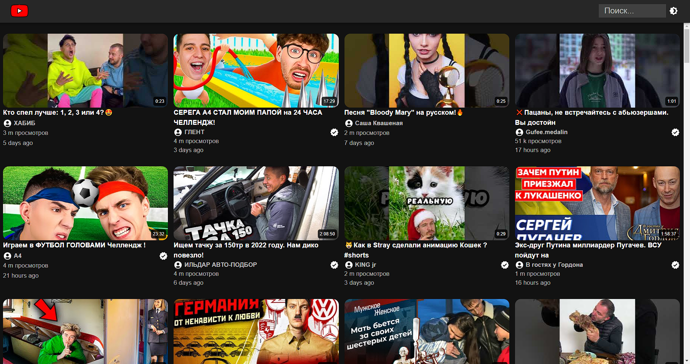

# YouTube clone  
### Цели:  
Задача - создание альтернативного YouTube-клиента на стороннем API.  
---     
### Реализация  
На данный момент готово:  
* Главная страница с самыми популярными видео RU-региона на данный момент.  
* Страница с результатами поискового запроса.  
* Поисковая строка по видео/каналам.  
* Страница с видео, на которой отображается стандартный YouTube-плеер, а так же блок рекомендаций на основе текущего видео.  
* Страница с каналом, где отображается все опубликованные каналом видео.  
---    
### Использование:  
* для запуска приложения используйте команду npm run dev;  
* для сборки проекта используйте команду npm run build;  
* для полноценной работы приложения необходимо получить API-ключ сервиса RapidAPI;  
* Демо приложения доступно по ссылке: [клик](https://youtube-clone-zeta-lemon.vercel.app/)  
---  
